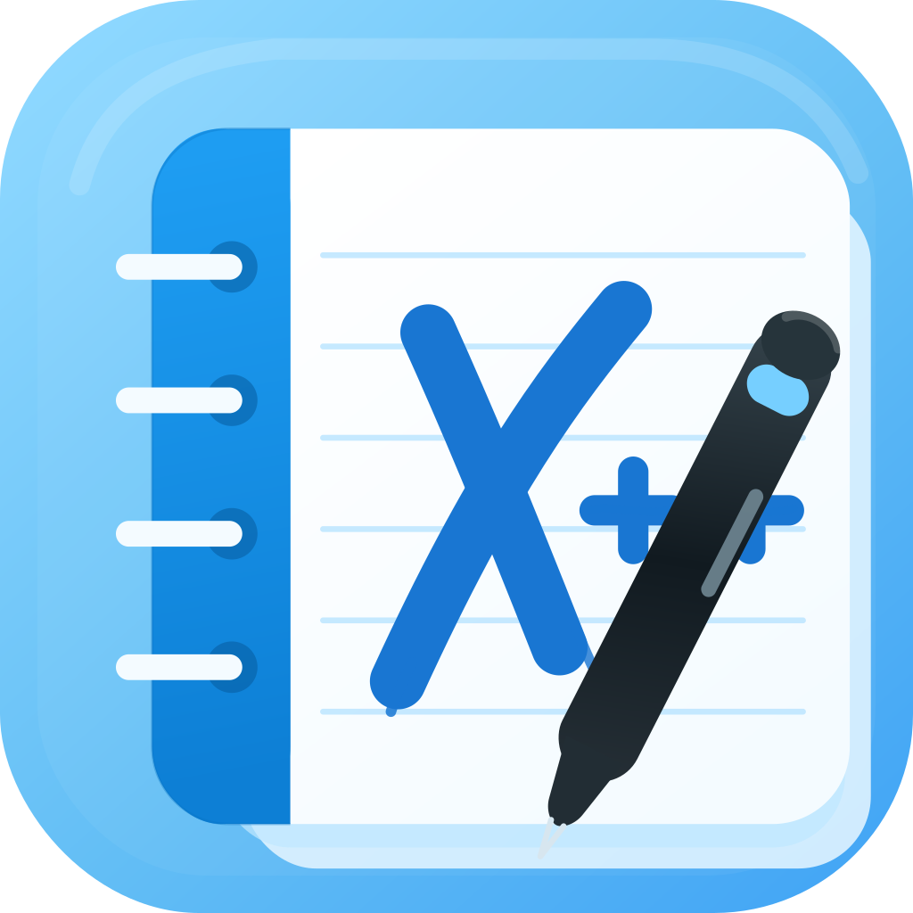

#  Xournal++ Mobile

[](https://github.com/robol/xournalpp_mobile)
[](LICENSE)

**Xournal++ Mobile** is an experimental Flutter-based mobile and web companion for working with Xournal++ `.xopp` documents.

This repository is a revived and modernized fork of the original **Xournal++ Mobile** project by [TheOneWithTheBraid](https://github.com/TheOneWithTheBraid), which was later mirrored under the [xournalpp/xournalpp_mobile](https://github.com/xournalpp/xournalpp_mobile) organization and is now archived/unmaintained.

The original codebase was already a remarkably capable and well-thought-out implementation: it supported much of the `.xopp` file format, rendered complex document contents, and provided a strong foundation for bringing Xournal++ documents to Flutter-supported platforms. This fork exists because that work was valuable enough to preserve and continue.

This version ports the project to a modern Flutter/Dart toolchain and includes a first working prototype together with a number of compatibility fixes.

> **Status:** early prototype. It works, but it is not yet production-ready. Please keep backups of important documents.

---

## What is this?

Xournal++ Mobile aims to bring core Xournal++ document viewing and editing features to Flutter-supported platforms, especially mobile devices and the web.

The goal is not to replace the desktop [Xournal++](https://github.com/xournalpp/xournalpp) application, but to make `.xopp` documents easier to open, inspect, annotate, and edit on devices where the desktop app is not available or convenient.

---

## Current status

This fork currently provides a first working prototype after updating the original codebase to modern Flutter.

A substantial part of the functionality comes from the excellent original implementation. The current work focuses on making that code build and run again with current Flutter/Dart versions, while gradually fixing compatibility issues and improving the app.

Working or partially working areas include:

* Opening `.xopp` documents
* Rendering pages
* Rendering strokes
* Rendering images
* Rendering text
* Rendering highlights
* Rendering LaTeX content
* Basic PDF rendering support
* Basic editing functionality
* Saving support
* Recent files support
* Modernized Flutter/Dart dependencies
* Fixes required to make the project build and run again

Some features are still incomplete, fragile, or need more testing.

---

## Supported platforms

The project is built with Flutter and contains platform folders for:

* Android
* iOS
* Web
* Linux
* macOS
* Windows

Android, iOS, and web are the main targets for this revival effort. Desktop platforms may build, but they are not yet the primary focus.

---

## Getting started

Install Flutter first:

```shell id="e93l18"
flutter doctor
```

Clone this repository:

```shell id="m326tn"
git clone https://github.com/robol/xournalpp_mobile.git
cd xournalpp_mobile
```

Fetch dependencies:

```shell id="vamxsu"
flutter pub get
```

Run on a connected device or emulator:

```shell id="k8rkv1"
flutter run
```

Run on the web:

```shell id="zfpzd8"
flutter run -d chrome
```

Build an Android APK:

```shell id="8kxedm"
flutter build apk
```

---

## Development notes

This fork removes the need for the old `--no-sound-null-safety` workflow and targets a modern Dart/Flutter environment.

The project currently uses Dart SDK constraints compatible with Dart 3:

```yaml id="7278iu"
environment:
  sdk: ">=3.10.0 <4.0.0"
```

Because this is a revived codebase, expect some older architectural decisions, TODOs, and rough edges to remain. That said, the original project was already much more complete than a simple proof of concept: many of the hard parts of parsing, representing, and rendering Xournal++ documents were already handled thoughtfully.

Contributions that preserve the spirit of the original work while improving compatibility, maintainability, performance, and mobile usability are welcome.

---

## `.xopp` file format

Xournal++ documents use the `.xopp` format. Useful background information can be found in the Xournal documentation:

http://www-math.mit.edu/~auroux/software/xournal/manual.html#file-format

---

## Roadmap

Possible next steps include:

* Improve stability when opening large documents
* Improve memory usage
* Better touch and stylus handling
* More reliable save/export behavior
* Better mobile UI and navigation
* Improve platform-specific file opening and sharing
* Add automated builds
* Add tests for `.xopp` parsing and rendering
* Prepare installable preview builds

---

## Known limitations

* This is an early prototype.
* Large documents may consume a lot of memory.
* Some `.xopp` files may not render perfectly.
* Editing support is still basic.
* Platform-specific behavior may differ between Android, iOS, web, and desktop.
* Store builds are not currently provided by this fork.

Please test with copies of your documents, not your only copy.

---

## Relationship to the original project

This project is based on the original **Xournal++ Mobile** project by [TheOneWithTheBraid](https://github.com/TheOneWithTheBraid).

Original project locations include:

* https://gitlab.com/TheOneWithTheBraid/xournalpp_mobile
* https://github.com/xournalpp/xournalpp_mobile

The original project deserves substantial credit. It already implemented a large amount of the difficult work required to read, display, and interact with Xournal++ documents in Flutter. In particular, its support for the `.xopp` format, page rendering, strokes, text, images, LaTeX, thumbnails, saving, and early editing made this revival possible.

This fork continues from that foundation after the original repository became unmaintained. The main goal is to preserve the original effort, make it usable again on modern Flutter, and continue improving it from there.

All credit for the initial idea, architecture, and original implementation goes to the original author and contributors.

---

## Contributing

Contributions are welcome, especially in these areas:

* Flutter modernization
* Android and iOS fixes
* Web support
* `.xopp` parsing/rendering correctness
* Performance and memory usage
* UI/UX improvements
* Tests and sample documents
* Documentation

Before making large changes, please open an issue or discussion so the direction can be coordinated.

---

## License

This project is licensed under the terms of the **European Union Public Licence v1.2**.

See [LICENSE](LICENSE) for details.
